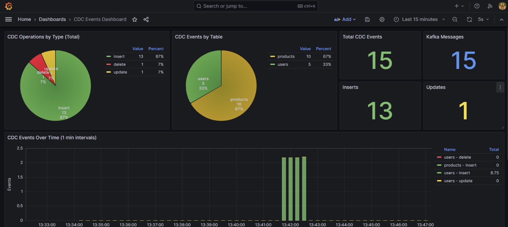
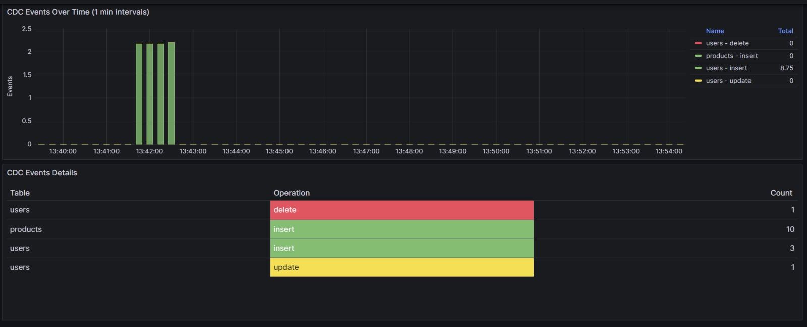

# TiDB CDC Ecosystem Application

A complete eco-system application featuring TiDB database with Change Data Capture (CDC), Apache Kafka message broker, real-time event processing, and comprehensive monitoring/logging dashboards.

## Architecture Overview

```
┌─────────────┐    ┌─────────────┐    ┌─────────────┐
│    TiDB     │───▶│   TiCDC     │───▶│    Kafka    │
│  (Database) │    │    (CDC)    │    │  (Message   │
└─────────────┘    └─────────────┘    │   Broker)   │
       │                              └──────┬──────┘
       │                                     │
       ▼                                     ▼
┌─────────────┐                      ┌─────────────┐
│     PD      │                      │   Node.js   │
│  (Placement │                      │  Consumer   │
│   Driver)   │                      └──────┬──────┘
└─────────────┘                             │
       │                           ┌────────┴────────┐
       ▼                           ▼                 ▼
┌─────────────┐              ┌──────────┐    ┌─────────────┐
│    TiKV     │              │Prometheus│    │  Filebeat   │
│  (Storage)  │              │ (Metrics)│    │   (Logs)    │
└─────────────┘              └────┬─────┘    └──────┬──────┘
                                  │                 │
                                  │                 ▼
                                  │          ┌─────────────┐
                                  │          │Elasticsearch│
                                  │          │   (Logs)    │
                                  │          └──────┬──────┘
                                  │                 │
                                  └────────┬────────┘
                                           ▼
                                    ┌─────────────┐
                                    │   Grafana   │
                                    │ (Dashboard) │
                                    └─────────────┘
```

## Components

| Component | Description | Port |
|-----------|-------------|------|
| **TiDB** | Distributed SQL database | 4000 |
| **PD** | Placement Driver for TiDB cluster | 2379, 2380 |
| **TiKV** | Distributed transactional key-value storage | 20160 |
| **TiCDC** | Change Data Capture component | 8300 |
| **Zookeeper** | Coordination service for Kafka | 2181 |
| **Kafka** | Message broker | 9092, 29092 |
| **Consumer** | Node.js CDC event processor | 3000 |
| **Prometheus** | Metrics collection and storage | 9090 |
| **Elasticsearch** | Log storage and search | 9200 |
| **Filebeat** | Log shipper | - |
| **Grafana** | Visualization and dashboards | 3001 |

## Quick Start

### Prerequisites

- Docker and Docker Compose installed
- At least 8GB of available RAM
- At least 10GB of available disk space

### Running the Application

Start the entire ecosystem with a single command:

```bash
docker-compose up
```

Or run in detached mode:

```bash
docker-compose up -d
```

### Verifying the Setup

1. **Check all services are running:**
   ```bash
   docker-compose ps
   ```

2. **Access the services:**
   - **Grafana Dashboard:** http://localhost:3001 (admin/admin)
   - **Prometheus:** http://localhost:9090
   - **Elasticsearch:** http://localhost:9200
   - **TiDB:** localhost:4000 (MySQL client)

3. **Connect to TiDB:**
   ```bash
   mysql -h 127.0.0.1 -P 4000 -u root
   # Or with the application user
   mysql -h 127.0.0.1 -P 4000 -u app_user -p'AppUser@123' app_db
   ```

## Database Schema

The application initializes with the following tables:

### users
```sql
CREATE TABLE users (
    id INT AUTO_INCREMENT PRIMARY KEY,
    username VARCHAR(100) NOT NULL UNIQUE,
    email VARCHAR(255) NOT NULL UNIQUE,
    password_hash VARCHAR(255) NOT NULL,
    first_name VARCHAR(100),
    last_name VARCHAR(100),
    status ENUM('active', 'inactive', 'suspended') DEFAULT 'active',
    created_at TIMESTAMP DEFAULT CURRENT_TIMESTAMP,
    updated_at TIMESTAMP DEFAULT CURRENT_TIMESTAMP ON UPDATE CURRENT_TIMESTAMP
);
```

### products
```sql
CREATE TABLE products (
    id INT AUTO_INCREMENT PRIMARY KEY,
    name VARCHAR(255) NOT NULL,
    description TEXT,
    price DECIMAL(10, 2) NOT NULL,
    stock_quantity INT DEFAULT 0,
    category VARCHAR(100),
    status ENUM('available', 'out_of_stock', 'discontinued') DEFAULT 'available',
    created_at TIMESTAMP DEFAULT CURRENT_TIMESTAMP,
    updated_at TIMESTAMP DEFAULT CURRENT_TIMESTAMP ON UPDATE CURRENT_TIMESTAMP
);
```

### orders
```sql
CREATE TABLE orders (
    id INT AUTO_INCREMENT PRIMARY KEY,
    user_id INT NOT NULL,
    total_amount DECIMAL(10, 2) NOT NULL,
    status ENUM('pending', 'processing', 'shipped', 'delivered', 'cancelled') DEFAULT 'pending',
    shipping_address TEXT,
    created_at TIMESTAMP DEFAULT CURRENT_TIMESTAMP,
    updated_at TIMESTAMP DEFAULT CURRENT_TIMESTAMP ON UPDATE CURRENT_TIMESTAMP,
    FOREIGN KEY (user_id) REFERENCES users(id) ON DELETE CASCADE
);
```

### order_items
```sql
CREATE TABLE order_items (
    id INT AUTO_INCREMENT PRIMARY KEY,
    order_id INT NOT NULL,
    product_id INT NOT NULL,
    quantity INT NOT NULL,
    unit_price DECIMAL(10, 2) NOT NULL,
    created_at TIMESTAMP DEFAULT CURRENT_TIMESTAMP,
    FOREIGN KEY (order_id) REFERENCES orders(id) ON DELETE CASCADE,
    FOREIGN KEY (product_id) REFERENCES products(id) ON DELETE CASCADE
);
```

## Default Users

| Username | Password | Description |
|----------|----------|-------------|
| root | (empty) | TiDB root user |
| app_user | AppUser@123 | Application database user |
| admin | Admin@123 | Default application user (in users table) |

## Testing CDC Events

After the system is running, you can test CDC by performing database operations:

### Insert a new user
```sql
USE app_db;
INSERT INTO users (username, email, password_hash, first_name, last_name)
VALUES ('testuser', 'test@example.com', 'hashed_password', 'Test', 'User');
```

### Update a product
```sql
UPDATE products SET price = 1399.99 WHERE name = 'Laptop Pro 15';
```

### Delete a record
```sql
DELETE FROM users WHERE username = 'testuser';
```

After each operation, you should see:
1. CDC events in the Grafana logs panel
2. Prometheus counters incremented
3. Pie chart updated with operation distribution

## Monitoring and Dashboards

### Grafana Dashboard

Access Grafana at http://localhost:3001 with credentials `admin/admin`.

The pre-configured dashboard includes:

1. **CDC Operations by Type (Pie Chart)** - Shows the distribution of INSERT, UPDATE, DELETE operations in the last hour (from Prometheus)

2. **CDC Events Rate** - Time-series graph showing event rates by table and operation

3. **Statistics Panels** - Total CDC events and Kafka messages received

4. **CDC Events Table** - Summary of events by table from Prometheus

5. **Raw CDC Events Log** - Real-time log stream from Elasticsearch

6. **CDC Events Table (Detailed)** - Tabular view of all CDC events with data

### Prometheus Metrics

Available at http://localhost:9090

Key metrics:
- `cdc_events_total{table_name, operation}` - Counter of CDC events
- `kafka_messages_received_total` - Total Kafka messages
- `cdc_events_processing_seconds` - Processing time histogram

### Elasticsearch

Available at http://localhost:9200

CDC events are indexed in `cdc-events-*` indices.

Query example:
```bash
curl http://localhost:9200/cdc-events-*/_search?pretty
```

## Screenshots





## Project Structure

```
.
├── docker-compose.yml          # Main orchestration file
├── README.md                   # This file
├── tidb-init/
│   ├── Dockerfile             # Init container image
│   ├── init.sql               # Database schema and seed data
│   └── wait-and-init.sh       # Initialization script
├── consumer/
│   ├── Dockerfile             # Consumer image
│   ├── package.json           # Node.js dependencies
│   └── index.js               # CDC consumer application
├── prometheus/
│   └── prometheus.yml         # Prometheus configuration
├── filebeat/
│   └── filebeat.yml           # Filebeat configuration
└── grafana/
    └── provisioning/
        ├── dashboards/
        │   ├── dashboards.yml # Dashboard provider config
        │   └── cdc-dashboard.json # Pre-configured dashboard
        └── datasources/
            └── datasources.yml # Data source configurations
```

## CDC Flow

1. **Database Change**: User performs INSERT/UPDATE/DELETE on TiDB
2. **TiCDC Capture**: TiCDC captures the change using internal replication
3. **Kafka Message**: Change event is published to Kafka topic `cdc_events` in Canal JSON format
4. **Consumer Processing**: Node.js consumer reads the message and:
   - Increments Prometheus counter with `table_name` and `operation` labels
   - Logs the event to a file
5. **Log Collection**: Filebeat reads the log file and sends to Elasticsearch
6. **Visualization**: Grafana displays metrics from Prometheus and logs from Elasticsearch

## Troubleshooting

### Services not starting

Check logs for specific services:
```bash
docker-compose logs tidb
docker-compose logs ticdc
docker-compose logs kafka
docker-compose logs consumer
```

### CDC changefeed not working

1. Check TiCDC status:
   ```bash
   curl http://localhost:8300/api/v2/changefeeds
   ```

2. Verify Kafka topic exists:
   ```bash
   docker-compose exec kafka kafka-topics --bootstrap-server localhost:9092 --list
   ```

### No data in Grafana

1. Ensure consumer is running and processing messages:
   ```bash
   docker-compose logs -f consumer
   ```

2. Check Prometheus targets are up:
   - Visit http://localhost:9090/targets

3. Verify Elasticsearch has data:
   ```bash
   curl http://localhost:9200/cdc-events-*/_count
   ```

### Reset everything

To start fresh:
```bash
docker-compose down -v
docker-compose up
```

## Stopping the Application

```bash
docker-compose down
```

To also remove volumes (data):
```bash
docker-compose down -v
```

## Documentation

For more detailed documentation, see the [docs](./docs/) folder:

- **[Quick Start Guide](./docs/QUICK_START_GUIDE.md)** - Step-by-step guide to clean, start, and test
- [Architecture Overview](./docs/ARCHITECTURE.md) - Detailed system design and data flow
- [Setup Guide](./docs/SETUP.md) - Complete installation and configuration guide
- [Monitoring Guide](./docs/MONITORING.md) - Using Grafana dashboards and queries
- [Troubleshooting](./docs/TROUBLESHOOTING.md) - Common issues and solutions
